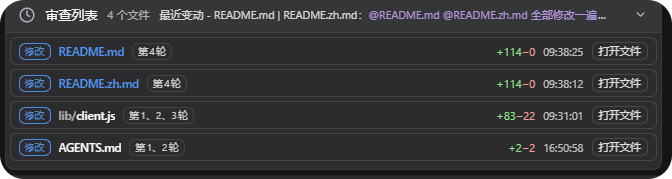
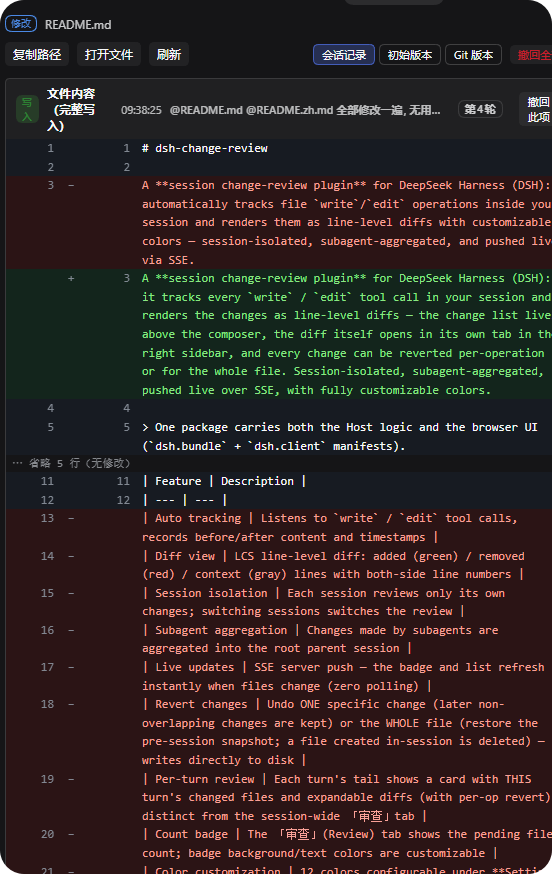

# dsh-change-review-live

> [!IMPORTANT]
> **This project is a fork of [cirelir/dsh-change-review](https://github.com/cirelir/dsh-change-review)**, substantially reworked on top of it (right-sidebar diff tabs, a live review list, a rename).
> The original author's copyright and the MIT license are retained — see [LICENSE](LICENSE).

**dsh-change-review-live** is a **live change-review** plugin for DeepSeek Harness (DSH): it tracks every `write` / `edit` tool call in your session and renders the changes as line-level diffs in real time — the change list lives above the composer, the diff itself opens in its own tab in the right sidebar, and every change can be reverted per-operation or for the whole file. Session-isolated, subagent-aggregated, pushed live over SSE, with fully customizable colors.

> One package carries both the Host logic and the browser UI (`dsh.bundle` + `dsh.client` manifests).

[中文说明](README.zh.md)

## ✨ Features

| Feature | Description |
| --- | --- |
| Auto tracking | Listens to `write` / `edit` tool calls and records the before/after content, the timestamp and the turn each change belongs to |
| Line-level diff | LCS diff: added (green) / removed (red) / context (gray) lines with both-side line numbers; long unchanged stretches collapse into an `⋯ N lines skipped (unchanged)` row |
| Review list | A persistent panel above the composer: status chip + path + turn badge + that turn's question + `+N/−N` + time. Click the header to collapse/expand; once expanded, drag to resize (the height is remembered per session on the Host) |
| Sidebar diff tab | A sidebar tab type registered by this plugin: the chip reads `filename (diff)` with a red/green diff icon, the body shows the file's full diff and its revert actions |
| Three comparison modes | Per file you can switch between `session log` (this session's recorded operations), `initial version` (the file as it was before this session's first change) and `Git version` (HEAD) |
| Revert | Undo a single change (later non-overlapping changes are kept) or every change to a file (restore the state before this session's first change; a file created in this session is deleted) — each action asks for confirmation and then writes the file on disk |
| Open file | Prefers opening the file inside DSH's right sidebar; when that service is missing or the address has no owner it falls back to the OS default handler |
| Context menu | On a diff line: copy `path#line` (copying a line range when several lines are selected) |
| File status | `added` / `modified` / `deleted` chips. Deleted means the file is not on disk right now (a file created and then deleted also shows as deleted): the name is struck through and **Open file** is disabled, while the diff stays reviewable and revertible |
| Color customization | Under **Settings → 实时审查**: 12 colors, each with an opacity slider (rgba), applied instantly and saved automatically; light/dark presets and a restore-defaults button included |
| Session isolation / subagent aggregation | Each session sees only its own changes; subagent changes are aggregated up the owner chain to the root parent session |
| Live updates | The Host broadcasts over SSE, so the list and the diff tab refresh as files change, with polling as a fallback |

## 📸 Screenshots

**Review list** — every file this session changed, listed live above the composer: status chip, path, turn, that turn's question and `+N/−N`



**Sidebar diff tab** — click a file name to review its per-operation diffs, section-level revert and the three comparison modes in the right sidebar



## 📦 Install

### `dsh plugin add`

```sh
dsh plugin --profile web add github:sujingkpo/dsh-change-review-live
```

> Installed straight from the GitHub repository (the package is not published on npm yet); replace `web` with `desktop` to install into the DSH Desktop profile. **Restart DSH afterwards.**
>
> The client bundle declares `platform: web`, so `dsh web` and DSH Desktop share it; it relies on DSH's right-sidebar APIs (`sidebarRightTabs` / `sidebarRight`).

## 🚀 Usage

1. Once a session writes or edits a file, the **Review list** panel appears above the composer (collapsed by default; it stays hidden while there is nothing to review). Click its header to expand — rows are ordered by most recent change
2. Each row shows the status chip, the path (the directory part may elide, the file name never does), a `turn N` badge, that turn's question, `+N/−N` and the time, ending with an **Open file** action
3. **Clicking the row or the file name opens that file's diff in the right sidebar**; the trailing **Open file** control opens the file itself in the sidebar instead (disabled while the file is deleted)
4. The sidebar diff tab has two header rows: the first holds the status chip and the path (hover for the absolute path); the second holds the actions — Copy path / Open file / Refresh / comparison mode (session log · initial version · Git version) / Revert all (session-log mode only)
5. The diff is grouped into `edit` / `write` sections, each header showing its label, time, that turn's question, the `turn N` badge and **Revert this** (session-log mode only)
6. Refresh semantics: **session log** updates automatically as the session changes (SSE, plus a 15-second fallback poll); **initial version / Git version** never auto-refresh — use the **Refresh** button. Polling pauses while the tab is not visible (sidebar collapsed or tab in the background)
7. Right-click a diff line to copy `path#line` (a line range when several lines are selected)
8. Colors: **Settings → 实时审查**; changes apply instantly and are saved automatically

## 🎨 Color Configuration

| Item | Key | Light default | Dark preset | Where it shows |
| --- | --- | --- | --- | --- |
| Added line background | `addBg` | `#e6ffec` | `#10251c` | Added diff lines |
| Added line text | `addFg` | `#1a7f37` | `#7ee787` | Added diff lines |
| Removed line background | `delBg` | `#ffebe9` | `#2d1415` | Removed diff lines |
| Removed line text | `delFg` | `#cf222e` | `#ffa198` | Removed diff lines |
| Context background | `ctxBg` | `#f6f8fa` | `#161b22` | Context diff lines |
| Line numbers / markers | `gutter` | `#57606a` | `#8b949e` | Line numbers and the `+/−` markers |
| Badge background | `badgeBg` | `#0969da` | `#4493f8` | No longer displayed (see below) |
| Badge text | `badgeFg` | `#ffffff` | `#0d1117` | No longer displayed (see below) |
| Added count (turn footer) | `turnAdd` | `#1a7f37` | `#7ee787` | Row `+N`, the `added` chip, the right half of the sidebar tab icon |
| Removed count (turn footer) | `turnDel` | `#cf222e` | `#ffa198` | Row `−N`, the `deleted` chip, the left half of the sidebar tab icon |
| Card background (turn footer) | `turnBg` | `rgba(255,183,77,.1)` | same | No longer displayed (see below) |
| Card border (turn footer) | `turnBorder` | `#ffb74d` | same | No longer displayed (see below) |

> `badgeBg` / `badgeFg` and `turnBg` / `turnBorder` used to style the review view tab's count badge and the per-turn review card. Both surfaces have been removed; the settings page still lists these four items, but changing them no longer affects any UI.

## 🧠 Behavior Notes

- **Scope**: every `write` / `edit` call in the current process, bucketed per session; subagent changes are aggregated up the owner chain to the root parent session
- **Real time**: the Host broadcasts over SSE (`/diff-review/events`); the client only processes events for the current session, with polling as a fallback
- **Persistence**:
  - Review records: `$DSH_HOME/diff-review/<sessionId>.json` (falling back to `~/.dsh` when `DSH_HOME` is unset), debounced auto-save plus a synchronous flush on exit, restored automatically after a restart — delete that directory to wipe the history
  - UI preferences: the panel height per session under `$DSH_HOME/diff-review/ui/<sessionId>.json`
  - Colors: browser localStorage (`dsh.diff-review.colors`)
- **Status rules**: `added` = the file's first operation had no prior content (created in this session); `deleted` = the file is not on disk right now (delete commands are never parsed); everything else is `modified`
- **Turn attribution**: each operation is tagged with the turn it happened in by scanning the session log's `turn/start` events; records written before that tagging existed are back-filled from the timeline
- **How revert works**: every operation stores the full before/after snapshot reported by the write/edit tool. Reverting the newest operation restores that snapshot exactly; reverting a middle one performs a three-way line merge that keeps later non-overlapping changes and refuses on overlap
- **Capacity guards**: at most 100 operations per file; up to 1500 lines per diff side; a 2000-line-per-side limit on the three-way merge; display fragments capped at 350,000 characters; files larger than 5,000,000 characters get no snapshot (that record degrades to a fragment diff and cannot be reverted)
- **Where changes take effect**: Host-side changes (`lib/index.js`) need a DSH restart; browser-side changes (`lib/client.js`) only need a page refresh

## 🗂 Architecture

```
Host (lib/index.js)
  · tools/result listener → per-session buckets + turn attribution
  · LCS line diff, three-way merge revert
  · HTTP: /diff-review/{events (SSE) · summary · file · turn · against · revert · ui-prefs · open}
        │  HTTP + SSE (same origin)
Browser UI (lib/client.js, __ModuleLoader__ bundle)
  · hidden SessionProbe syncing the current session
  · LivePanel: the review list above the composer (conversation.input.dock)
  · self-registered sidebar tab type dsh-change-review-live:diff-review: body under sidebar.right.pane.tab, chip icon under sidebar.right.pane.tab.title
  · Settings page 「实时审查」 for color customization
```

## ⚖️ Disclaimer

Plugin code runs with the same privileges as your harness process. Review the source before installing; inclusion in community markets is not a security endorsement.

## 📄 License

MIT
